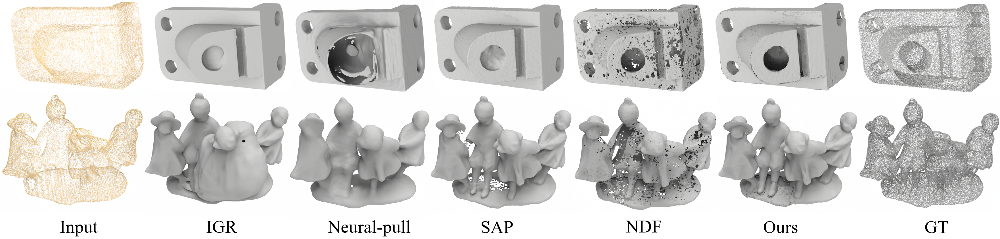

<p align="center">

  <h1 align="center">Learning Consistency-Aware Unsigned Distance Functions Progressively from Raw Point Clouds</h1>
  <p align="center">
    <a href="https://junshengzhou.github.io/"><strong>Junsheng Zhou*</strong></a>
    ·
    <a href="https://mabaorui.github.io/"><strong>Baorui Ma*</strong></a>
    ·
    <a href="https://yushen-liu.github.io/"><strong>Yu-Shen Liu</strong></a>
    ·
    <a href="https://engineering.nyu.edu/faculty/yi-fang"><strong>Yi Fang</strong></a>
    ·
    <a href="https://h312h.github.io/"><strong>Zhizhong Han</strong></a>

  </p>
  <p align="center"><strong>(* Equal Contribution)</strong></p>
  <h2 align="center">NeurIPS 2022</h2>
  <h3 align="center"><a href="https://arxiv.org/pdf/2210.02757.pdf">Paper</a> | <a href="https://junshengzhou.github.io/CAP-UDF">Project Page</a></h3>
  <div align="center"></div>
</p>

<p align="center">
  
</p>

We propose to learn a consistency-aware unsigned distance field to represent shapes and scenes with arbitary architecture. We show a 2D case of learning the distance field from a sparse 2D point cloud $P$ which only contains 13 points. The level-sets show the distance fields learned by (a) Neural-pull, (b) SAL, (c) NDF, (d) Ours. The color of blue and red represent positive or negative distance. The darker the color, the closer it is to the approximated surface.

## Overview
<p align="center">
  
</p>

Overview of our method. The CAP-UDF is designed to reconstruct surfaces from raw point clouds by learning consistency-aware UDFs. Given a 3D query $q_i \in {Q_1}$ as input, the neural network $f$ predicts the unsigned distance $f(q_i)$ of $q_i$ and moves $q_i$ against the gradient direction at $q_i$ with a stride of $f(q_i)$. The field consistency loss is then computed between the moved queries $q'_i$ and the target point cloud $P$ as the optimization target. After the network converges in the current stage, we update $P$ with a subset of $q'_i$ as additional priors to learn more local details in the next stage. Finally, we use the gradient vector field of the learned UDFs to model the relationship between different 3D grids and extract iso-surfaces directly.

## Demo Results
### ShapeNetCars
<p align="center">
  
</p>

### 3DScenes
<p align="center">
  
</p>

### SRB
<p align="center">
  
</p>

## Related works
Please also check out the following works that inspire us a lot:
* [Baorui Ma et al. - Neural-Pull: Learning Signed Distance Functions from Point Clouds by Learning to Pull Space onto Surfaces (ICML2021)](https://github.com/mabaorui/NeuralPull-Pytorch)
* [Baorui Ma et al. - Surface Reconstruction from Point Clouds by Learning Predictive Context Priors (CVPR2022)](https://mabaorui.github.io/PredictableContextPrior_page/)
* [Baorui Ma et al. - Reconstructing Surfaces for Sparse Point Clouds with On-Surface Priors (CVPR2022)](https://mabaorui.github.io/-OnSurfacePrior_project_page/)

## Installation
Our code is implemented in Python 3.8, PyTorch 1.11.0 and CUDA 11.3.
- Install python Dependencies
```bash
conda create -n capudf python=3.8
conda activate capudf
conda install pytorch torchvision torchaudio cudatoolkit=11.3 -c pytorch
pip install tqdm pyhocon==0.3.57 trimesh PyMCubes scipy point_cloud_utils
```
- Compile C++ extensions
```
cd extensions/chamfer_dist
python setup.py install
```

## Dataset
We provide the processed data for ShapeNetCars, 3DScenes and SRB dataset [here](https://drive.google.com/file/d/1BNzmd_OX0s4lxta3FFeRWRYwfGQOALS_/view?usp=sharing). Unzip it to the `./data` folder. The datasets is organised as follows:
```
│data/
├──shapenetCars/
│  ├── input
│  ├── ground_truth
│  ├── query_data
├──3dscene/
│  ├── input
│  ├── ground_truth
│  ├── query_data
├──srb/
│  ├── input
│  ├── ground_truth
│  ├── query_data
```
We provide all data of the 3DScenes and SRB dataset, and two demos of the ShapeNetCars. The full set data of ShapeNetCars will be uploaded soon.

## Train
You can train our CAP-UDF to reconstruct surfaces from a single point cloud as:

- ShapeNetCars
```
python run.py --gpu 0 --conf confs/shapenetCars.conf --dataname 3e5e4ff60c151baee9d84a67fdc5736 --dir 3e5e4ff60c151baee9d84a67fdc5736
```

- 3DScene
```
python run.py --gpu 0 --conf confs/3dscene.conf --dataname lounge_1000 --dir lounge_1000
```

- SRB
```
python run.py --gpu 0 --conf confs/srb.conf --dataname gargoyle --dir gargoyle
```

You can find the generated mesh and the log in `./outs`.

## Test
You can evaluate the reconstructed meshes and dense point clouds as follows:

- ShapeNetCars
```
python evaluation/shapenetCars/eval_mesh.py --conf confs/shapenetCars.conf --dataname 3e5e4ff60c151baee9d84a67fdc5736 --dir 3e5e4ff60c151baee9d84a67fdc5736
```

- 3DScene
```
python evaluation/3dscene/eval_mesh.py --conf confs/3dscene.conf --dataname lounge_1000 --dir lounge_1000
```

- SRB
```
python evaluation/srb/eval_mesh.py --conf confs/srb.conf --dataname gargoyle --dir gargoyle
```

For evaluating the generated dense point clouds, you can run the `eval_pc.py` of each dataset instead of `eval_mesh.py`. 

## Use Your Own Data
We also provide the instructions for training your own data in the following.

### Data
First, you should put your own data to the `./data/owndata/input` folder. The datasets is organised as follows:
```
│data/
├──shapenetCars/
│  ├── input
│      ├── (dataname).ply/xyz/npy
```
We support the point cloud data format of `.ply`, `.xyz` and `.npy`

### Run
To train your own data, simply run:
```
python run.py --gpu 0 --conf confs/base.conf --dataname (dataname) --dir (dataname)
```

### Notice

In different datasets or your own data, because of the variation in point cloud density, this hyperparameter [scale](https://github.com/junshengzhou/CAP-UDF/blob/eb22ffd4b3f34d4fa74e1863ece7ff37d63d03cc/models/dataset.py#L51) has a very strong influence on the final result, which controls the distance between the query points and the point cloud. So if you want to get better results, you should adjust this parameter. We give `0.25 * np.sqrt(POINT_NUM_GT / 20000)` here as a reference value, and this value can be used for most object-level reconstructions. 

## Citation
If you find our code or paper useful, please consider citing

    @inproceedings{Zhou2022CAP-UDF,
        title = {Learning Consistency-Aware Unsigned Distance Functions Progressively from Raw Point Clouds},
        author = {Zhou, Junsheng and Ma, Baorui and Liu, Yu-Shen and Fang, Yi and Han, Zhizhong},
        booktitle = {Advances in Neural Information Processing Systems (NeurIPS)},
        year = {2022}
    }
